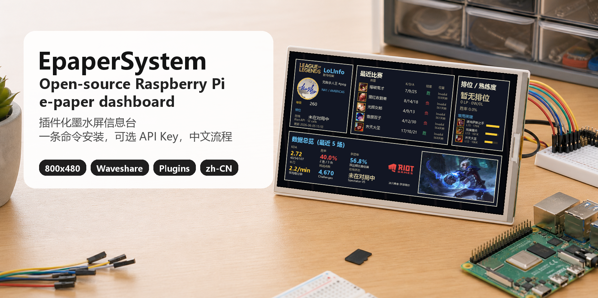

# EpaperSystem



EpaperSystem is an open-source e-paper dashboard for Raspberry Pi. The public
GitHub experience is installer-first: clone the repo, run one minimal installer,
follow the prompts, and see working dashboard pages immediately.

简体中文：EpaperSystem 是一个面向树莓派墨水屏的信息台项目。GitHub
上的公开版本应该优先提供极简安装体验：克隆项目、运行一个安装程序、跟随引导填写必要信息，然后马上看到可展示的页面。

## Built On InkyPi

EpaperSystem is built on top of the open-source
[InkyPi](https://github.com/fatihak/InkyPi) project. Thanks to the InkyPi
maintainers and community; this project would not exist without that foundation.

简体中文：EpaperSystem 的一切都建立在开源
[InkyPi](https://github.com/fatihak/InkyPi) 项目的基础上。感谢 InkyPi
维护者和社区提供的基础工程、插件架构和安装体系。

The runnable app lives here:

```text
inkypi-weather/package/InkyPi
```

Legacy `dashboard-7in5/` prototype code is archived on branch `archive/dashboard-7in5`; it is no longer part of the runnable app tree.

README screen content now starts with a public sample render from the real
SportsDashboard plugin, then mixes in saved device captures from the
`ColoredEpaperFrame` workflow. img-2 was used only for the desk/device scene
and empty display frames.


## What GitHub Provides

The GitHub release should feel like a small installable product, not a toolkit
that requires users to understand the whole runtime first.

- A single beginner-facing root installer entrypoint: `install.sh`.
- Guided setup for display type, language, optional API keys, service start,
  and health checks.
- API registration hints during setup, so users know where each key comes from.
- A safe skip path: every API prompt can be skipped during installation.
- Demo-ready pages when keys are skipped: key-dependent plugins should show
  placeholder, cached, or sample content instead of failing with a blank page.
- A later configuration path through the web UI or command line.

简体中文：GitHub 上应该呈现为一个可以直接安装的软件项目，而不是需要用户先理解所有脚本和插件的工具箱。

- 入口只保留给新手看的根目录安装程序：`install.sh`。
- 安装过程中引导选择屏幕型号、语言、可选 API Key、服务启动和健康检查。
- API Key 引导里提供注册/获取地址。
- 每个 API Key 都允许跳过。
- 如果用户跳过 API Key，对应页面仍应使用占位、缓存或样例数据展示，而不是空白或报错。
- 用户之后仍可在 Web UI 或命令行中补充 API Key。

## Minimal Installer

On a fresh Raspberry Pi, the shortest path is one command:

```bash
curl -fsSL https://raw.githubusercontent.com/Feeengyuuu/EpaperSystem/main/install.sh | sudo bash
```

Simplified Chinese one-line install:

```bash
curl -fsSL https://raw.githubusercontent.com/Feeengyuuu/EpaperSystem/main/install.sh | sudo bash -s -- --lang zh-CN
```

If you prefer cloning first:

```bash
sudo apt-get update
sudo apt-get install -y git
git clone https://github.com/Feeengyuuu/EpaperSystem.git
cd EpaperSystem
sudo bash install.sh
```

The default installer targets a Waveshare 7.3 inch color e-paper display using
driver `epd7in3e`.

Other display examples:

```bash
sudo bash install.sh -W epd7in5_V2
sudo bash install.sh --pimoroni
```

The root installer clones or updates the project when used through `curl`,
delegates to `inkypi-weather/package/InkyPi/install/bootstrap.sh`, creates a
starter `.env`, offers API key prompts, starts the service, and runs a health
check. Users who want the fastest preview can skip all API prompts and add keys
later.

Full guides:

- English: [Install From Zero](inkypi-weather/package/InkyPi/docs/install_from_zero.md)
- 简体中文：[从零安装](inkypi-weather/package/InkyPi/docs/install_from_zero.zh-CN.md)
- Development: [Local Tests](docs/development.md)

## API Keys And Demo Mode

API keys are optional at install time. During setup, users can choose common
keys, all known keys, or skip key entry entirely. Skipping keys should not block
installation.

When a provider key is missing, the expected product behavior is:

- start the app normally;
- keep the plugin visible in the playlist;
- render placeholder, cached, or sample content for that page;
- explain missing configuration in the plugin or API key UI when useful;
- let the user add the key later without reinstalling.

Command-line helpers:

```bash
cd inkypi-weather/package/InkyPi
python3 install/configure_api_keys.py --list
python3 install/configure_api_keys.py --list --lang zh-CN
python3 install/configure_api_keys.py --env-file .env
python3 install/configure_api_keys.py --check
```

Web UI after install:

```text
http://<your-pi>/api-keys
```

Key guides:

- English: [API Keys](inkypi-weather/package/InkyPi/docs/api_keys.md)
- 简体中文：[API Key 获取地址](inkypi-weather/package/InkyPi/docs/api_keys.zh-CN.md)

## Plugin Author Rule

Plugins that depend on third-party services should be public-demo safe:

- register required or optional keys in `install/api_key_registry.json`;
- never require a real key just to render the page shell;
- provide placeholder or sample state when credentials are missing;
- keep real secrets in `.env` only;
- make the health check warning actionable instead of fatal when a key is
  optional.

## Health Check

```bash
cd inkypi-weather/package/InkyPi
bash install/healthcheck.sh
bash install/healthcheck.sh --lang zh-CN
```

## Before Publishing

Do not publish local secrets or runtime state. This repo ignores `.env`,
`.ssh/`, `.secrets-backup/`, `.tmp/`, `tmp/`, caches, and Python bytecode, but
you should still verify Git history before making a public repository.

Before a public GitHub release, confirm that the README, installer, API key
registry, placeholder behavior, screenshots, and health check all describe the
same beginner path.

Checklist: [Open Source Release Checklist](docs/open_source_release_checklist.md)

## License

The InkyPi package is distributed under GPL-3.0. See
[LICENSE](inkypi-weather/package/InkyPi/LICENSE).
