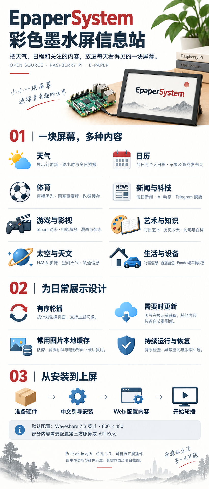

# EpaperSystem



EpaperSystem 是基于 **Raspberry Pi + 彩色墨水屏** 的开源信息站。把天气、日程、赛事和关注的内容集中在一块屏幕上，通过局域网 Web 界面配置页面与轮播。

An open-source Raspberry Pi e-paper dashboard for weather, calendars, sports, news, culture and connected devices, with a web interface and configurable playlists.

介绍图为功能与硬件示意；下方的截图入口提供程序样例和历史实机画面。部分内容需要配置第三方服务或 API Key。

## 内容与使用

- **天气与日历**：天气在展示前重新取数；日历整合节日、个人日程、苹果与游戏发布会，按空间补充后续事项。
- **体育与资讯**：直播优先的体育分区、同赛事后续赛程、赛事标识与队徽缓存，以及新闻、AI 动态、Telegram 摘要和直播雷达。
- **游戏、影视与文化**：Steam 动态、电影海报、漫画、杂志、每日艺术、历史今天、词句与百科。
- **太空与设备**：NASA 影像、空间天气、轨道信息、行情、Bambu 打印机与车辆状态等内容，按对应服务配置启用。
- **日常运行**：页面轮播、主题切换、图片本地缓存、健康检查、异常重试与发布版本回退。天气之外的内容按各自刷新策略更新，数据及时性取决于来源与连接状态。

## 开始使用

准备好树莓派、microSD 卡、网络和墨水屏，在 Raspberry Pi 上运行：

```bash
git clone https://github.com/Feeengyuuu/EpaperSystem.git
cd EpaperSystem
sudo bash install.sh --lang zh-CN
```

默认配置为 **Waveshare 7.3 英寸彩色墨水屏，800 × 480，驱动 `epd7in3e`**。其他支持的 Waveshare 或 Pimoroni 屏幕请按安装指南选择。安装时可跳过 API Key，之后再配置需要的服务。

- [从零安装（简体中文）](inkypi-weather/package/InkyPi/docs/install_from_zero.zh-CN.md) · [Installation guide (English)](inkypi-weather/package/InkyPi/docs/install_from_zero.md)
- [API Key 获取与配置](inkypi-weather/package/InkyPi/docs/api_keys.zh-CN.md) · [API keys (English)](inkypi-weather/package/InkyPi/docs/api_keys.md)
- [开发与本地测试](docs/development.md) · [编写插件](inkypi-weather/package/InkyPi/docs/building_plugins.md)

## 界面截图

- [体育页面：公开样例渲染](inkypi-weather/package/InkyPi/docs/images/readme/screens/actual-sports-dashboard-800x480.png)
- [历史实机截图合集](inkypi-weather/package/InkyPi/docs/images/readme/epaper-system-real-screens.png)
- [插件展示墙](inkypi-weather/package/InkyPi/docs/images/readme/epaper-system-plugin-wall.png)

## 开源基础与许可

EpaperSystem 建立在开源 [InkyPi](https://github.com/fatihak/InkyPi) 之上，感谢原项目维护者和社区提供的应用、插件架构与安装体系。可运行的应用位于 `inkypi-weather/package/InkyPi`。

The InkyPi package is distributed under **GPL-3.0**. See [LICENSE](inkypi-weather/package/InkyPi/LICENSE).
