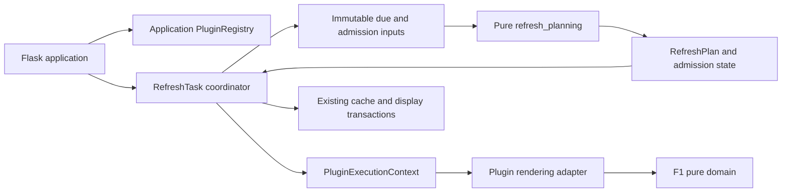

# Architecture optimization and release acceptance

The user approved the September 4 review and implementation through successful
deployment validation. The implementation starts from `edbd90813ecc904d5064d6311cee22387954a44f`,
which matched the live release on September 4. The dirty primary checkout is
preserved. The design retains the single device coordinator, bounded workers,
existing freshness rules, and display/configuration transactions.

## Agreed behavior boundaries

These are the test seams and acceptance criteria from the approved review:

- CI command entry points reject invalid non-first shell files and validate the
  vehicle service with locked dependencies, type checking, and local tests.
- Scheduling decisions consume snapshots and preserve data/presentation/live
  priorities, deadlines, resource deferrals, and rotation fairness.
- Plugin execution carries explicit cancellation and instance identity while
  adapting existing plugin implementations. Separate application registries
  cannot overwrite each other's plugin instances.
- One sports domain is extracted behind explicit dependencies; existing event
  selection and image output remain compatible.
- Architecture checks reject forbidden dependency directions in extracted
  modules and growth beyond the accepted complexity baseline.
- Release acceptance requires exact source identity, terminal refresh jobs,
  readiness, valid current imagery, and natural hardware write evidence.

## Implementation sequence

1. Fix the per-file shell parser and add the vehicle CI job.
2. Extract typed scheduler decision/command policy and wire it into production.
3. Scope plugin registration to the application and expose execution context.
4. Extract a sports domain and migrate its tests to public behavior seams.
5. Add enforceable architecture boundaries and developer documentation.
6. Run full and clean-archive tests, review, build an LF-safe release, deploy,
   validate live behavior and natural rotation, and publish the verified commit.

Small compatibility adapters are allowed where removing legacy callers in one
step would widen risk. They must route to the new authority rather than maintain
a second implementation. New resource capabilities remain fail-closed.

## Progress

- Baseline: remote and live SHA match; live `/healthz` is alive and `/readyz` is ready.
- Primary review described the older local working tree; all implementation is
  rebased on the current remote/live tree, including recent Weather and Sports fixes.
- Baseline Python suite: 6215 passed, 54 skipped, 21 warnings (Python 3.11.9).
- Integrated scheduling/F1 regression: 1549 passed. Explicit execution-context
  regression: 595 passed. Registry/application regression: 33 passed.
- Vehicle service: locked install, type check, 96 tests, and Wrangler dry-run build passed.
- Architecture gate: 436 Python files checked. Mypy checks the three new typed
  boundaries; imported annotations are analyzed with `follow_imports=silent`.
- Final full/clean-archive and device acceptance are release gates, recorded with
  the deployed source revision in the release verification evidence.

## Resulting ownership

The coordinator still owns clock/resource sampling, queue admission, retries,
Weather/Sports/Ticketmaster liveness, and durable commits. The new planner cannot
import plugins, configuration or the coordinator. It evaluates due work, prevents
duplicate provider presentation fetches, selects reserved presentation work, and
maps admitted lanes to command intent/priority. Starvation concession remains
before reserved presentation, which remains before the rotation deadline guard.
The selection method shrank from 818 to 634 physical lines; CI caps it at 650.
The remaining coordinator is deliberately a staged extraction, not a completed
rewrite of every scheduling policy.

Each app places its registry in `app.extensions["plugin_registry"]` and passes
the same object to `RefreshTask`. Metadata loading stays lazy and concurrent first
access constructs exactly one instance per plugin per app. The old module-level
functions and dictionaries are standalone compatibility adapters to one default
registry, with the same implementation as app-owned registries.

`BasePlugin.render_with_context(settings, device_config, *, execution_context,
**render_options)` is the explicit rendering entry point. The runtime supplies
cancellation/deadline, instance revision and its image runner. Existing plugin
renderers remain supported through an adapter. Manual commands without a playlist
UUID have no instance CAS; superseded playlist results retain `stale_selection`.
Provider-free cached display and specialized isolated/presentation paths retain
their existing audited contracts and receive the legacy binding from the same
explicit execution context. Runtime admission and final transaction validation
remain authoritative.

The F1 pilot moves 18 Jolpica parsing, polling and event-selection functions to
`f1_domain.py`; normalized AST comparison confirmed identical logic. The mixin
delegates its old entry points and imports remaining adapter dependencies
explicitly. OpenF1 enrichment, drawing, and the other sports domains remain in
their existing adapters; the pure domain does not import them.

## Development rules and validation

- Use the installed import namespace (`runtime`, `plugins`, `model`, etc.). Never
  import it a second time through `src.*`; enum/dataclass identity would differ.
  The test bootstrap now sets the source directory centrally.
- Add behavioral cases at the pure planner/domain or app/execution boundary.
  Existing integrated scheduler tests continue to protect fairness, physical
  commit ordering, retries and display freshness.
- Run `python tools/check_architecture.py` and `python -m mypy --no-incremental`
  from the repository root. Install `install/requirements-quality.txt` with
  `--require-hashes` for the latter; this lock is development-only and does not
  change the Raspberry Pi runtime dependency lock.
- CI rejects forbidden imports, wildcard imports in the F1 pilot, duplicate
  namespaces, oversized extracted functions and coordinator size regression.
- CI uses one `bash -n` invocation per release script. Passing several filenames
  to a single invocation checks only the first file.
- The independent vehicle job installs its package lock, type-checks, tests and
  builds without deploying the Cloudflare worker.

Mypy import handling follows its [official documentation](https://mypy.readthedocs.io/en/stable/running_mypy.html).
The initial type-check scope is the new planner, execution context and registry;
it is not a claim that all legacy plugins are statically typed.

The [overnight analysis](../reviews/2026-09-04-overnight-optimization.zh-CN.md)
adds two evidence-based corrections: local cached-display redraw capabilities
exclude unnecessary theme catch-up; an existing Weather quiet window may recover
at its ordinary memory margin even when another ordinary candidate becomes due.
A new provider failure closes that window and preserves provider retry backoff.

Release preparation also fixes the existing CI timeout by running full and clean
archive suites in separate matrix jobs. The security audit identified three
runtime updates (Pillow 12.3.0, cryptography 50.0.1, pi-heif 1.3.0) and the
development pip 26.2.1 update; regenerated locks preserve all other versions.
Five historical secret-scan findings were verified as deterministic test cache
keys or a schema field set and excluded only by exact historical fingerprints.
