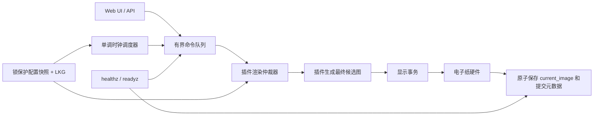

# EpaperSystem 健康化设计

> 日期：2026-07-09
> 状态：三线审阅后修订，待用户确认
> 目标：在保留现有插件、配置和显示行为的前提下，把项目修复为可启动、可停止、可恢复、资源有界、升级可回滚且能被持续验证的程序。

## 1. 背景与目标

当前项目的功能覆盖和测试基础都比较完整，但“测试大体通过”还不等于设备能长期健康运行。审计确认的主要风险集中在：刷新线程可能空转、停止通知可能丢失、队列和缓存无上限、硬件等待无超时、离线启动会失败、显示状态可能先于硬件提交、插件在扫描阶段被提前加载、安装升级缺少失败回滚，以及管理接口默认信任局域网。

本次工作不以大规模重写或统一格式为目标，而以以下可观察结果为完成标准：

1. 无网络、空播放列表、插件报错、显示硬件忙等异常不会导致崩溃、热循环或永久挂起。
2. 服务可以在 systemd 停止窗口内可靠退出，后台线程和子进程能被回收。
3. 手动刷新、后台刷新和前台显示之间有明确的并发所有权；队列、图片、浏览器和磁盘缓存都有边界。
4. `current_image` 只代表硬件已成功提交的最终图像；配置损坏时能回退到最后一份有效版本。
5. 安装和升级先验证新版本，再原子切换；失败自动回滚，不留下半安装状态。
6. 全量测试在目标 Python 3.11 和干净检出中通过，不依赖被忽略的本地字体或缓存。
7. 健康端点能区分“进程活着”和“已准备好刷新/显示”，并暴露足够的故障定位信息。

## 2. 方案比较

### 方案 A：只修当前已复现的 P0 缺陷

优点是改动最小、短期最快。缺点是刷新线程、状态模型、安装链和资源治理仍彼此耦合；修掉热循环后，删除竞态、队列膨胀或显示状态不一致仍会在长期运行中暴露。该方案不满足“正常健康工作”的结果要求。

### 方案 B：分阶段原位加固（采用）

保留现有 Flask、Playlist、Plugin 和 Display 结构，通过小接口和兼容层逐步收紧边界。每一阶段先写失败测试，再做最小实现，并且阶段结束时跑相关测试和全量回归。它能控制回归面，也允许在任一阶段安全回退。

### 方案 C：重写调度器和插件平台

从长期架构看最整洁，但会同时触碰 57 个插件、Web API、配置和真机驱动，难以证明行为等价；现有未提交功能也会被卷入迁移。风险和工期不适合本轮健康化工作。

## 3. 总体结构

采用四个可独立验收的工作流：



- 运行时工作流：调度、停止、队列、并发与失败退避。
- 状态工作流：配置、Playlist 快照、显示事务、硬件和启动降级。
- 资源工作流：插件惰性加载、HTTP/图片/浏览器边界与缓存预算。
- 运维工作流：安装升级、健康检查、安全边界、依赖与 CI。

工作流按顺序落地，但接口在总体设计中一次确定，避免后续反复改动核心文件。

## 4. 运行时工作流

### 4.1 调度与停止

刷新循环改用 `time.monotonic()` 维护“下次允许尝试时间”，业务时间仍用墙上时间判断播放计划。无可用实例、实例消失、插件失败和显示失败都必须推进尝试时间；普通自动任务按实例采用 30、60、120、300 秒并封顶 300 秒的退避，加入不超过 10% 的 jitter，成功后复位。手动任务可以绕过一次自动退避，但仍受队列、并发和总 deadline 约束。monotonic deadline 不持久化；墙上时间只用于诊断，重启后最多恢复一个初始退避周期。

生命周期使用明确状态机：

`STARTING → RUNNING → QUIESCING → DRAINING → STOPPED`，超时路径为 `DRAINING → FORCED_EXIT`。

- 进入 `QUIESCING` 后立即拒绝新任务，queued job 进入 `canceled`。`cancel_requested` 不是 Job status，而是 `running` 记录上的时间戳；置位后任务不得转为 `succeeded`，协作退出转 `canceled`，超过 deadline 转 `abandoned`。
- 独立 `threading.Event` 负责停止；Condition 只保护命令队列和 JobRecord，不覆盖网络、渲染、磁盘、子进程或硬件调用。
- 默认 240 秒 systemd 窗口中，应用自己的总预算为 210 秒：前 5 秒关闭接入和取消队列，150 秒内协作 drain，随后 40 秒终止浏览器/隔离子进程并收尾，最后预留 15 秒给日志、状态和 systemd。测试通过注入毫秒级预算验证同一状态机。
- 已知分钟级或不可合作任务使用有界子进程执行器，deadline 后 terminate/kill/wait；普通插件仍优先在进程内执行，但所有已知 I/O 和硬件边界必须有 timeout。若第三方进程内代码完全不返回，最终记录 `abandoned` 并走 `FORCED_EXIT`；`os._exit(75)` 仅作为该末级兜底，不是正常回收机制。
- Wi-Fi、缓存、浏览器和长任务 worker 都登记到生命周期管理器；线程默认可协作停止，不能创建未登记的 daemon worker。

### 4.2 有界命令队列

手动刷新和后台刷新走同一锁保护入口。队列元素是不可变 `Command`：

```text
Command(id, kind, source, instance_uuid, structural_generation,
        settings_revision, force, priority, enqueued_at, deadline)
```

`kind` 至少区分 `DISPLAY` 和 `CACHE_REFRESH`；`source` 区分 manual、scheduler、live 和 background。语义如下：

- 默认容量 32，硬上限 128；至少 4 个槽只供 manual display 使用，后台任务不能占满所有槽。
- manual display > scheduled display > live refresh > background cache；连续执行 3 个高优先级任务后，若低优先级仍有效则允许一个低优先级任务，避免永久饥饿。
- 同一 `instance_uuid + kind` 的 queued 命令可合并：只替换为较新的 revision 引用，`force` 采用 OR；旧 JobRecord 终态为 `superseded` 并指向新 job。
- queued `DISPLAY` 可吸收同实例的 `CACHE_REFRESH` 需求；cache 永远不能覆盖、降级或取消 display。不同 structural generation 绝不合并。
- Job 状态只允许单向迁移：`queued → running → succeeded|failed|canceled|abandoned`，另有入口终态 `rejected` 和排队终态 `superseded`。terminal 历史最多 256 条且最多保留 30 分钟。
- 队列满且无法合并时返回稳定 JSON：`error_code=refresh_queue_full`、HTTP 429 和 `Retry-After: 5`。相同幂等键或已合并请求返回 202 及实际 job ID。
- 删除实例时取消尚未执行的对应任务；停止接入后提交返回 503 `refresh_service_stopping`。
- 队列深度、拒绝数、合并数、等待时间和 Job 状态进入只读健康快照与日志。

### 4.3 并发所有权

插件注册表按 `plugin_id` 缓存 Python 单例，因此 render/cleanup 互斥锁的 key 是 `plugin_id`，而不是 Playlist 业务实例。两个 Playlist 实例只要共用一个插件类型，就不能同时进入该 Python 单例；cleanup 和缓存清理也走同一仲裁器。长任务执行期间持有该插件类型的 lease，但不会持有队列、Playlist、Config 或 display 锁。

每个 Playlist 业务实例新增稳定 `instance_uuid`。旧配置首次加载时生成并原子持久化；删除后同名重建必须得到新 UUID，避免 ABA。身份版本拆分为：

- `structural_generation`：创建、删除或移动等结构变化。
- `settings_revision`：影响插件输入的设置变化。
- 运行时 attempt/success/failure 状态：独立存储，绝不推进前两个版本。

任务只保存 UUID 和 revision，不保存可变 settings。执行前从 PlaylistManager 取得不可变快照；结果提交前再次比对 UUID/generation/revision。实例已删除、设置已变化或任务已取消时，迟到结果直接丢弃，不能复活缓存或上屏。

锁规则是“短锁、禁止嵌套”：queue lock 只取命令；释放后取 Playlist 快照；释放后进入 plugin arbiter；渲染结束释放 plugin lease；需要上屏时再进入全局 display transaction lock；用户配置持久化由单独串行 ConfigStore 完成。健康端点不获取这些锁，只读原子发布的状态快照。

成功、失败和尝试时间分别记录：

- `last_attempt_at`
- `last_success_at`
- `last_failure_at` / `last_error`
- `next_retry_at`

背景失败不得更新成功时间。

运行时状态写入独立的有界 runtime state 文件，而不是高频重写用户 `device.json` 或 LKG。

## 5. 状态与显示工作流

### 5.1 Playlist 与配置一致性

PlaylistManager 提供锁内的 `snapshot`、候选 `update/delete` 和版本号接口；蓝图和调度器不再直接修改可变对象。所有用户配置变更由 ConfigStore 事务串行化：基于当前版本构建候选副本、完成 schema 与业务不变量校验、写临时文件并 fsync、原子 replace、fsync 父目录，最后以 compare-and-swap 发布新的内存快照。任何写盘步骤失败时内存保持旧版本，API 返回明确失败；不允许“内存已改、磁盘未改”的 dirty 成功状态。

Manager 锁和 ConfigStore 锁永不嵌套。LKG 只有在候选配置完整验证且主文件持久化成功后才更新，权限固定为 0600，最多轮换两份。首次启动无 LKG、主文件语法损坏、JSON 有效但 schema 损坏分别处理；损坏原件带时间戳隔离留存，不静默替换为空配置。

### 5.2 显示事务

所有启动、手动和定时显示走同一个全局 transaction lock。跨两个文件不能真正原子，因此采用“不可变图片 + 单一原子 manifest”协议：

1. 根据显示设置生成最终像素图，写入 `display/objects/<commit_id>.png`，完成文件与目录 fsync。
2. 计算 `pixel_hash` 和 `hardware_fingerprint`；后者包含方向、反色、增强、驱动型号/模式及其他会影响硬件的设置。
3. 若二者与上一提交相同，可跳过硬件，但 `logical_target` 变化时仍创建 metadata-only commit。
4. 否则调用驱动，并按该型号的 busy/deadline 契约等待“命令已被驱动接受且 busy 已正常结束”。这不虚假承诺能够检测每个物理像素是否改变。
5. 硬件成功后，原子 replace 唯一权威的 `display/current.json`；内容包括 schema、commit ID、对象文件名、两个 hash、logical target、实例 revision、render/hardware/commit 时间和 release ID。
6. `/api/current_image` 始终通过 manifest 解析不可变图片。`current_image.png` 仅是提交后的兼容派生物，不作为真相来源。

状态分别记录 `render_success`、`hardware_success` 和 `commit_success`。硬件失败保留旧 manifest。硬件已成功但 manifest 写入失败时，内存状态变为 `display_unknown`、`readyz` 返回 503；重启恢复时重新提交最后一份已知 manifest 图片，使软件与屏幕回到可证明状态，再接受新显示任务。孤儿对象由 CacheManager 延迟回收。

所有 Waveshare BUSY 等待使用短轮询、取消检查和按显示型号配置的 deadline；未配置型号默认 90 秒。超时抛出包含驱动和阶段的异常，不能无限自旋。

### 5.3 启动和关闭降级

IP 探测失败返回本机名/未知地址，不能阻止服务启动；启动画面生成失败只记录警告。缓存清理、Wi-Fi 监控、浏览器和插件后台线程统一登记到生命周期管理器，在退出前停止。保留 watchdog 的最终兜底，但正常路径不依赖 `os._exit()` 回收资源。

## 6. 插件与资源工作流

### 6.1 能力声明和惰性加载

`plugin-info.json` schema v2 增加显式能力字段，例如 `supports_live_refresh`。所有内置插件在本轮迁移为显式 true/false，并用契约测试保证 true 时确有 hook。调度扫描只读清单元数据，只有声明能力且存在活动实例时才加载模块。

第三方 schema v1 插件缺字段时不执行运行时 import 探测；兼容器只静态解析模块 AST，发现 hook 后写入独立 capability cache 并发出迁移告警，保留两个发布周期。无法判定时默认 false 并明确告警，不能静默假装支持。

`refreshOnDisplay` 严格区分字段缺失、布尔 `false` 和字符串 `"false"`：实例显式值优先，其次 manifest 默认，最后 BasePlugin 默认；统一解析器拒绝其他含糊值。

### 6.2 网络和图片边界

共享 HTTP 客户端规定 connect/read timeout 和总 deadline。默认只对幂等 GET/HEAD 的连接失败及 429/502/503/504 重试一次，尊重但封顶 `Retry-After`，使用指数退避和 jitter；POST 默认不自动重试。流式响应边读边执行字节上限。Session 按线程/渲染生命周期复用并由生命周期管理器关闭，不把仍依赖 Session 的裸 Response 泄漏给插件；适配层在返回前消费为 bytes/JSON/已脱离文件的图片。

统一 `safe_open_image` 默认限制 25 MiB 下载、8192 单边、8 百万像素和允许格式；需要放宽的插件必须显式声明且不得超过全局硬上限。它把解压炸弹 warning 当作失败，默认只读取动画首帧，执行 EXIF transpose、完整 `load()` 和 copy 后再关闭 response/file，返回值所有权属于调用者。内置插件中绕过 loader 的路径列入迁移清单并有静态契约测试。

新写入的零、负数、未知单位或非数字刷新间隔直接返回 400；读取旧错误配置时归一化到明确的 1 分钟下限并记录一次告警，不使用含糊的“拒绝或归一化”。

### 6.3 浏览器与长任务

TechPulse 等私有 Chromium 路径迁入一个 BrowserRenderer：远程 URL 和本地 HTML 使用分开的入口，全局并发 1，每次使用隔离临时 profile，禁用下载，stdout/stderr 各封顶 1 MiB，维护唯一进程组。超时按 terminate → 短等 → kill → wait 升级，finally 清理 profile/HTML，并通过已登记 PID 检查 orphan。负缓存 key 包含规范化 URL、viewport 和 renderer 版本，默认 TTL 10 分钟；输入或版本变化立即失效。远程入口在每次 DNS 解析和重定向后重新执行 SSRF 校验。

长任务使用统一 `TaskContext(cancel_event, deadline_monotonic)`，贯穿 HTTP、轮询、浏览器和提交边界。Pi 默认长任务执行器并发 1、排队 2，和普通 display 队列分离但共享实例 generation 校验。AI Horde、浏览器等已知不合作风险放入可终止子进程；普通插件不自动跨进程迁移。任何取消、删除或 revision 变化后的迟到结果均丢弃，不能写缓存或上屏。

### 6.4 缓存预算

CacheManager 只自动管理它创建并登记的根目录。resolved path 必须始终位于该根，拒绝符号链接和越界删除；本地字体、旧 ignored 文件、用户上传内容和未知目录不属于托管缓存，仍需用户授权清理。

- 内存默认全局 32 MiB；单一图片缓存最多 128 条且估算像素内存不超过 20 MiB，LRU 淘汰。
- 磁盘默认每插件 50 MiB、256 文件、最长 30 天；全局托管缓存 512 MiB，并保留至少 `max(512 MiB, 10% disk)` 的空闲空间。
- 写入前先淘汰；单对象仍超限或无法恢复预算时拒绝缓存写入，但允许结果直接显示。并发写使用原子临时文件；超过 1 小时的托管 `.tmp` 在启动和每日维护时回收。
- Ticketmaster 图片、Sports logo、TechPulse 截图接入统一预算。清理失败记录告警、指标和目标路径，但不阻断已有缓存显示。

## 7. 运维、安全与发布工作流

### 7.1 可回滚安装升级

稳定目录契约为：

```text
/opt/inkypi/releases/<release-id>/   # 只读代码和该版本 venv
/opt/inkypi/current                  # 当前 release 原子 symlink
/opt/inkypi/previous                 # 上一 release 原子 symlink
/etc/inkypi/inkypi.env               # 0600 secrets / EnvironmentFile
/var/lib/inkypi/config/              # device.json、LKG、迁移备份
/var/lib/inkypi/data/                # 用户数据与非缓存持久内容
/var/cache/inkypi/                   # CacheManager 托管缓存
/var/lib/inkypi/update-state.json    # 原子更新事务日志
```

systemd unit 使用固定入口 `/opt/inkypi/current/...` 和固定 EnvironmentFile。release 不可就地修改；默认保留当前、previous 和一个额外已知健康版本。配置迁移只在事务目录副本上执行，必须声明 schema 的向前/向后兼容性；不能被 previous 读取的迁移不得在同一自动更新中上线。

所有权固定为：`/opt/inkypi` 与 systemd unit 由 root 管理且运行用户不可写；`/etc/inkypi/inkypi.env` 为 root 0600，由 systemd 在降权前读取；`/var/lib/inkypi` 和 `/var/cache/inkypi` 只授予 `inkypi` 服务用户。unit 变更与旧 unit 一同进入更新事务，daemon-reload 或启动失败时恢复旧 unit 和链接。

更新状态机为 `DOWNLOADED → PREFLIGHTED → SWITCHED → STARTING → HEALTHY → COMMITTED`，任一步可进入 `ROLLING_BACK → ROLLED_BACK|ROLLBACK_FAILED`。切换前只执行不占用端口/SPI 的导入、配置副本、静态资源、依赖和 no-hardware preflight。随后停止旧服务，原子更新 current/previous 和必要的 unit 备份，daemon-reload 后启动新服务；在 120 秒 grace 内只探测 `127.0.0.1` 固定端口，并要求 `/readyz` 返回目标 release ID。失败则恢复链接、unit 与配置指针并启动旧版本。更新事务每步先写 durable journal，掉电恢复根据最后阶段继续回滚或确认，不猜测。

Shell 脚本启用 `set -Eeuo pipefail`，后台命令必须 `wait` 并传播退出码。卸载默认保留 `/etc/inkypi` 和 `/var/lib/inkypi`，只有显式 `--purge` 二次确认后删除。

远程包必须使用 HTTPS、固定版本/提交和 SHA256 校验；SSH 主机密钥不能使用无限制的 `accept-new` 作为长期策略。失败注入覆盖下载、pip、配置迁移、daemon-reload、启动、readyz、磁盘不足和切换中断。GitHub runner 只证明 shell 状态机；真实 systemd/SPI/掉电恢复必须在 disposable Pi/VM 的部署授权阶段验证。

### 7.2 管理面安全

本轮安全威胁模型是“私有 LAN 上仍可能存在不受信客户端；禁止直接暴露公网”。策略如下：

- 所有写操作均需认证、CSRF/同源与 Host 校验，并按客户端和动作限速；API key、关机/重启、Screenshot URL、上传和删除在旧安装上也绝不允许匿名兼容。
- 新安装生成一次性 bootstrap token（0600，仅 root/本机可读），用户用它建立管理员凭据；服务只保存强密码哈希，支持恢复和轮换，不把 token 写日志。旧安装升级时也生成该 token，升级后只读页面可访问，写操作需先完成配对。
- plain HTTP 不能抵抗 LAN 嗅探；远程管理只在受信 LAN 内作为兼容，UI 明确警告。公网或不受信网络必须使用受支持的 TLS 反向代理，session cookie 在 TLS 下启用 Secure。DNS rebinding 通过固定 Host allowlist 和认证共同阻断。
- Screenshot 默认只允许公共 HTTP(S)，拒绝 loopback、链路本地、云元数据和私网地址；显式私网需求使用管理员配置的 CIDR/host 白名单，并对每次重定向重查。
- systemd 迁移到专用 `inkypi` 用户，只授予 GPIO/SPI/视频和数据目录权限。shutdown/reboot、Wi-Fi power-save 等特权动作通过只接受固定子命令和参数的最小 root helper/polkit 规则完成；Chromium 启用 sandbox。
- 全局请求体默认 8 MiB、单上传默认 5 MiB、multipart parts 默认 128；插件可以在全局硬上限内声明更小边界，超限返回 413。

### 7.3 配置契约和 CI

建立单一 SecretSchema，API key 页面、别名解析和 `.env.example` 从同一数据源生成或由契约测试校验，覆盖 Ticketmaster、Telegram、OpenAI 和 Bambu 等现有变量。

CI 以 Python 3.11 为发布门槛，开发环境也对齐 3.11，另跑未来版本兼容任务；使用带 hash 的 constraints/lock，并增加 aarch64/Pi 依赖解析。GitHub Actions 固定 commit SHA、最小 `contents: read` 权限和 job timeout。门禁包含：全量 pytest、`git archive` 临时干净树测试、Ruff 阻断规则、ShellCheck、安装状态机失败注入、依赖漏洞/secret 扫描和可安装性检查。核心新模块设置增量 coverage 门槛，但不伪造全仓统一高覆盖。不会在本轮对全仓做机械格式化；只要求改动文件不新增 lint 债务。

## 8. 健康接口和可观测性

健康端点只读取每秒至多更新一次、通过引用替换发布的不可变 HealthSnapshot；不获取 queue/plugin/display/config 锁，不访问网络、磁盘、GPIO 或硬件。本机响应预算 50 ms，测试硬上限 200 ms。

- `/healthz` 是 liveness：Web 主循环和生命周期快照可响应即返回 200，只公开 `status`、release ID、boot ID 和 uptime。
- `/readyz` 返回 `ready`、`degraded` 或 `not_ready`。`ready/degraded` 为 200，`not_ready/starting` 为 503；详细诊断只对已认证管理员开放。
- 启动 grace 默认 120 秒。生命周期非 RUNNING、配置无有效版本、display state unknown、调度心跳超过 `max(2 × scheduler_tick, active_operation_deadline + 10s)`、磁盘低于硬阈值时为 not_ready。
- 无网络但可用缓存、用户有意配置的空播放列表、开发模式无硬件、短时队列满为 degraded，不触发重启。队列持续满 60 秒且调度心跳停滞才为 not_ready。
- 正常的最长硬件 busy 操作写入 active deadline，不因 90 秒操作误判心跳；过 deadline 才转故障。
- 状态字段包括最后 attempt/render/hardware/commit、队列/拒绝/合并、当前任务、缓存预算、磁盘、内存/cgroup、display commit、rollback 原因和 OOM 计数。错误码稳定；URL 去 query、settings 只显示键名、secret 永不进入快照或日志。

## 9. 测试与验收矩阵

实施采用 TDD。每个缺陷先有能在旧实现上失败的测试，再修改生产代码。

### 9.1 核心自动化门槛

1. fake monotonic 推进 50 ms 时，每个失败目标最多一次 attempt 和一次聚合日志；不使用容易 flaky 的真实短 sleep 作为主要断言。
2. stop 覆盖等待、condition 边界、插件、浏览器、fsync、BUSY、显示结束窗口和不合作任务，并验证正常 drain 与 forced-exit 状态路径。
3. 队列测试覆盖容量、保留槽、优先级/公平性、合并矩阵、superseded/rejected、429、terminal history、停止后提交和删除取消。
4. 两个业务实例共用一个 plugin ID、cleanup/render 竞争、删除后同名重建 ABA 和迟到结果都不能并发或复活状态。
5. Config/Playlist 并发 update/delete/snapshot/write 无死锁；temp write、fsync、replace、LKG 更新每个崩溃点都有故障注入。
6. 显示测试覆盖相同像素不同 logical target、只改硬件设置、并发 GET、硬件成功后 manifest 失败、三种入口并发和每个 commit 阶段重启恢复。
7. 离线启动、BUSY 超时和 readyz 在核心锁占用/硬件忙时仍快速返回。
8. 内置 manifest v2 全覆盖；未声明插件不进入 `sys.modules`，第三方 v1 静态兼容有告警，实例 `false` 能覆盖默认 true。
9. 超大图片在完整解码前拒绝；100 次浏览器失败后残留 PID/临时目录为 0；托管缓存清理后低于字节和文件预算；取消长任务无迟到提交。
10. 安装状态机每个失败点都证明旧 release 和旧配置可启动；真实 systemd/SPI/掉电只在 disposable 设备阶段声明通过。
11. 当前全量测试、目标 Python 3.11 测试和不含 ignored 文件的 `git archive` 临时干净树测试全部通过。DailyWiki 用 fixture 验证微软雅黑优先，并在无私有字体时断言 tracked Noto fallback。

### 9.2 运行验证

本地完成：单元/集成测试、静态检查、脚本语法与失败注入、干净快照验证。30 分钟模拟调度 soak 作为 nightly/manual gate，验收 RSS 在预热后无持续线性增长、托管磁盘回到预算内、失败重试符合退避。真机部署、systemd、电子纸 BUSY、掉电回滚和 24 小时 soak 属于外部状态变更，必须在用户明确授权部署后执行；本地完成时不会声称已经通过真机验证。

## 10. 兼容、迁移与回滚

- 现有 `device.json`、Playlist 和插件 settings 不做破坏性格式迁移；新增字段有默认值。
- 新 UUID、manifest 和 LKG 均有 schema/version；旧配置迁移先备份且只添加兼容字段，previous release 的可读性由升级 preflight 验证。
- API 保持原响应结构，新增的 429/503 只出现在原本无法安全接受请求的情况。
- 每个工作流独立提交，阶段结束均可回退；不混入当前工作区已有的 DailyWiki、SportsDashboard、TechPulse、Ticketmaster 等用户改动。
- CacheManager 可以按声明预算自动淘汰它创建的托管缓存；不会删除本地字体、虚拟环境、旧 ignored 文件、用户上传或未知目录，这些清理仍需用户授权。

## 11. 明确不做

1. 不重写 Flask 应用或 57 个插件。
2. 不一次性消灭所有复杂度、宽泛异常或格式化差异。
3. 不在缺少真机指标时引入常驻浏览器池或盲目提高内存/队列上限。
4. 不擅自推送、部署、修改真机配置或清理用户数据。
5. 不把本轮之外的现有未提交改动重新归类、覆盖或丢弃。

## 12. 实施顺序

1. 先冻结并测试 Command/Job/InstanceIdentity、锁层级、生命周期和最小 plugin arbiter；随后修复热循环、停止、队列、删除竞态、离线启动、BUSY 超时和干净字体测试。
2. 一致性：Config 事务/LKG、显示 manifest 事务和恢复协议。
3. 资源：能力声明、惰性加载、刷新设置优先级、HTTP/图片/浏览器/缓存预算。
4. 运维：健康端点、SecretSchema、请求边界、安装升级回滚、安全默认值、CI。
5. 总验收：定向测试、全量回归、干净快照、模拟 soak、代码复审和未解决风险清单。

该顺序优先恢复“不会挂、能停、能恢复”，再治理长期资源和发布安全；每一步都保持可运行状态。
