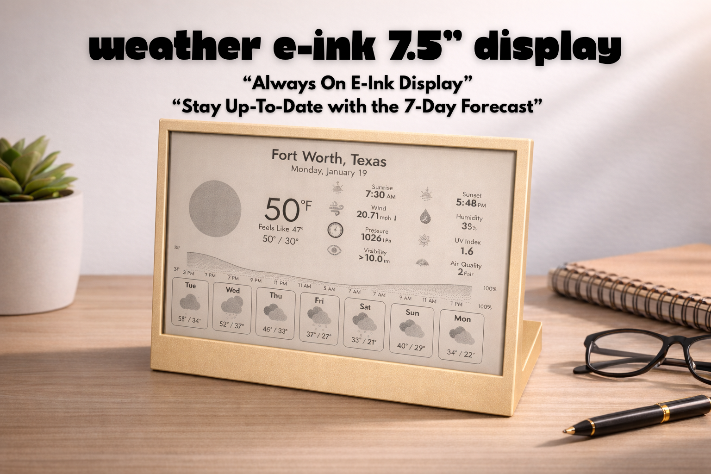

A minimal e-ink weather station using a Raspberry Pi Zero 2 W and Waveshare 7.5" display. No additional fees. Open source.

## Features

- 🌡️ Current conditions, feels-like temp, high/low
- 📊 24-hour temperature graph
- 📅 7-day forecast
- 🌅 Sunrise/sunset, UV index, air quality
- 💨 Wind, pressure, humidity
- 🌐 Web-based configuration UI

## Hardware

| Component | Notes | Est. Cost |
|-----------|-------|-----------|
| Raspberry Pi Zero 2 W | WH (pre-soldered headers) recommended | ~$30 |
| Waveshare 7.5" E-Ink HAT | 800×480 B/W, SPI interface | ~$70 |
| 8GB+ microSD Card | Brand Name | ~$8 |
| 5V Micro-USB Power | Often included in Pi kits | — |
| 3D Printed Frame | STL files | — |

**Total: ~$100**

## Software Stack

- **OS:** Raspberry Pi OS Lite (64-bit)
- **Framework:** HUGE SHOUTOUT!!! This project would not be possible without [InkyPi](https://github.com/fatihak/InkyPi) by @fatihak
- **Weather:** [Open-Meteo](https://open-meteo.com/) (free, no API key) or [OpenWeatherMap](https://openweathermap.org/api/one-call-3)

## Quick Start

### 1. Get API Key (Optional)

Open-Meteo requires no API key. For OpenWeatherMap:
- Sign up at [openweathermap.org](https://openweathermap.org/api)
- Subscribe to One Call API 3.0 (free tier: 1,000 calls/day)
- Note: Requires card on file

### 2. Flash SD Card

Use [Raspberry Pi Imager](https://www.raspberrypi.com/software/):
- **OS:** Raspberry Pi OS Lite (64-bit)
- **Settings:** Enable SSH, set WiFi, set timezone

### 3. Hardware Setup

Set HAT switches before assembly:
- **Display Config:** B
- **Interface Config:** 0

### 4. Install InkyPi

    ssh username@weather.local
    
    sudo apt update && sudo apt install -y git
    git clone https://github.com/fatihak/InkyPi.git
    cd InkyPi
    sudo bash install/install.sh -W epd7in5_V2

### 5. Install BCM2835 (Recommended)

    cd ~
    wget http://www.airspayce.com/mikem/bcm2835/bcm2835-1.71.tar.gz
    tar zxvf bcm2835-1.71.tar.gz
    cd bcm2835-1.71/
    sudo ./configure && sudo make && sudo make check && sudo make install

### 6. Configure API Key (OpenWeatherMap only)

    cd ~/InkyPi
    echo "OPEN_WEATHER_MAP_SECRET=your-key-here" > .env
    sudo systemctl restart inkypi

### 7. Configure via Web UI

1. Browse to http://weather.local or your IP address
2. Select Weather plugin
3. Choose provider (Open-Meteo or OpenWeatherMap)
4. Enter coordinates
5. Set refresh to 15 minutes

## 3D Print Links
- [Bambu Labs](https://makerworld.com/en/models/2285672-weather-e-ink-7-5inch-display#profileId-2493121)
- [Printables](https://www.printables.com/model/1567210-weather-e-ink-75inch-display)

## Troubleshooting

**Display blank:**
- Check SPI enabled: `ls /dev/spi*`
- Check service: `sudo systemctl status inkypi`
- View logs: `journalctl -u inkypi -f`

**Web UI won't load:**
- Restart service: `sudo systemctl restart inkypi`

## Credits

- [InkyPi](https://github.com/fatihak/InkyPi) by fatihak
- [Waveshare](https://www.waveshare.com/)
- [Open-Meteo](https://open-meteo.com/)

## License

Documentation: MIT | STL Files: CC BY-NC-SA 4.0
